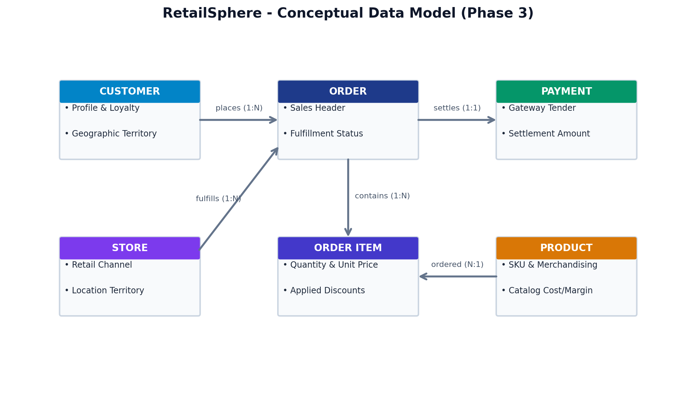
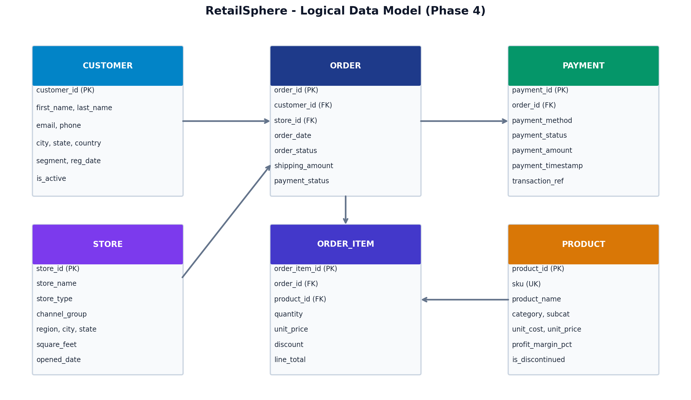
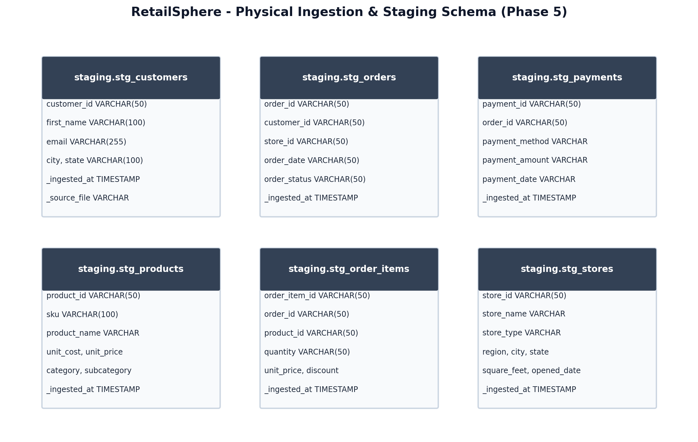
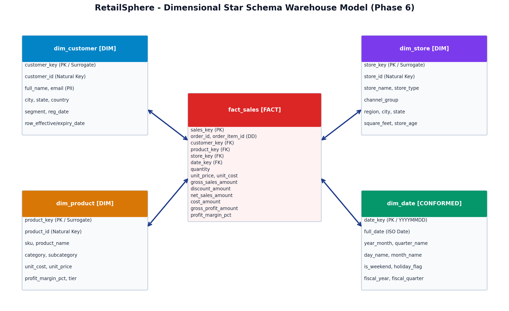

# 🛒 RetailSphere: Enterprise Sales & Customer Data Warehouse + Data Governance Platform

[](.github/workflows/ci.yml)
[](https://duckdb.org/)
[](dbt_retail_dw/)
[](docs/data_quality_report.md)
[](tests/)
[](metadata/)

> **Targeted Interview Role:** Associate Data Modeller / Analytics Engineer / Data Warehouse Engineer (Capgemini, Accenture, Deloitte).  
> **Core Deliverables:** Conceptual, Logical & Physical Modelling, Kimball Star Schema, Python ETL Pipeline, 10-Point Data Quality & Quarantine Framework, dbt Transformation Layer, Enterprise Data Dictionary, Data Lineage, Cloud BigQuery DDL, and Interactive BI Dashboard.

---

## 🏗️ 1. Enterprise Architecture Overview

```mermaid
flowchart TD
    subgraph S1 [Operational Data Sources]
        C[customers.csv 10k+]
        P[products.csv 1k+]
        S[stores.csv 50+]
        O[orders.csv 50k+]
        OI[order_items.csv 90k+]
        PY[payments.csv 50k+]
    end

    subgraph S2 [Ingestion & Staging Layer]
        L[Python + Pandas Ingestion Engine]
        STG[(Staging Schema / Raw Landing)]
    end

    subgraph S3 [Data Quality & Governance Layer]
        DQ{10-Point DQ Engine\\nNull | PK | FK | Range | Date}
        QR[(Quarantine Isolation\\nErr Codes)]
    end

    subgraph S4 [Transformation Engine: dbt + SQL]
        STG_M[dbt Staging Models]
        INT_M[dbt Intermediate Models]
        MART_M[dbt Marts Models]
    end

    subgraph S5 [Enterprise Dimensional Warehouse]
        DC[dim_customer]
        DP[dim_product]
        DS[dim_store]
        DD[dim_date]
        FS[fact_sales]
        FP[fact_payments]
    end

    subgraph S6 [Serving, Analytics & Cloud]
        BI[Streamlit BI Dashboard]
        DICT[Data Dictionary XLSX/MD]
        LIN[Data Lineage Docs]
        BQ[(Google BigQuery Cloud DW)]
    end

    C & P & S & O & OI & PY --> L --> STG
    STG --> DQ
    DQ -- "Invalid Records" --> QR
    DQ -- "Cleansed Records" --> STG_M --> INT_M --> MART_M
    MART_M --> DC & DP & DS & DD & FS & FP
    DC & DP & DS & DD & FS & FP --> BI & DICT & LIN & BQ
```

---

## 📊 2. Comprehensive Data Modeling Layers

### 🟢 Phase 3 — Conceptual Data Model
High-level view of retail entities (`CUSTOMER`, `ORDER`, `PRODUCT`, `STORE`, `PAYMENT`) and their fundamental cardinality.



---

### 🟡 Phase 4 — Logical Data Model
Technology-agnostic relational specification with attributes, Primary Keys, Foreign Keys, and business constraints.



---

### 🔵 Phase 5 — Physical Ingestion & Staging Model
Physical implementation schema optimized for high-throughput operational data ingestion.



---

### ⭐ Phase 6 — Dimensional Star Schema (Kimball Methodology)
Centralized fact tables (`fact_sales`, `fact_payments`) surrounded by conformed dimensions (`dim_customer`, `dim_product`, `dim_store`, `dim_date`).



---

## 🧪 3. 10-Point Data Quality & Quarantine Framework

Our automated validation engine actively isolates anomalies before warehouse ingestion:

| # | Check Category | Target Table & Column | Severity | Enforcement Action |
| :-: | :--- | :--- | :-: | :--- |
| **1** | **Null Check** | `stg_orders.customer_id`, `stg_products.sku` | `CRITICAL` | Quarantine (`ERR_NULL_CUSTOMER_KEY`) |
| **2** | **Duplicate Check** | `stg_orders.order_id`, `stg_customers.customer_id` | `CRITICAL` | Deduplicate / Quarantine (`ERR_DUPLICATE_ORDER`) |
| **3** | **Primary Key Uniqueness** | `dim_customer.customer_key`, `dim_product.product_key` | `CRITICAL` | Reject duplicate PKs |
| **4** | **Referential Integrity** | `stg_order_items.product_id` -> `products.product_id` | `CRITICAL` | Quarantine orphan records (`ERR_ORPHAN_PRODUCT_KEY`) |
| **5** | **Range Validation** | `stg_order_items.quantity > 0`, `unit_price > 0` | `HIGH` | Quarantine non-positive items (`ERR_INVALID_QUANTITY`) |
| **6** | **Business Logic Math** | `line_total == (qty * unit_price) - discount` | `HIGH` | Quarantine math discrepancies (`ERR_MATH_MISMATCH`) |
| **7** | **Date Consistency** | `stg_orders.order_date <= CURRENT_DATE` | `HIGH` | Quarantine future orders (`ERR_FUTURE_ORDER_DATE`) |
| **8** | **Syntax / Format** | `stg_customers.email` (Regex `%@%.%`) | `MEDIUM` | Quarantine malformed emails (`ERR_MALFORMED_EMAIL_SYNTAX`) |
| **9** | **Payment Reconciliation**| `fact_payments.payment_amount >= 0` | `HIGH` | Audit log flag |
| **10**| **Completeness Audit** | Mandatory attributes across dimensions | `MEDIUM` | Audit logging |

---

## 🟣 4. dbt Transformation Layer Structure

```text
dbt_retail_dw/
├── dbt_project.yml
├── profiles.yml
├── models/
│   ├── staging/
│   │   ├── stg_customers.sql
│   │   ├── stg_products.sql
│   │   ├── stg_stores.sql
│   │   ├── stg_orders.sql
│   │   ├── stg_order_items.sql
│   │   ├── stg_payments.sql
│   │   └── schema.yml
│   ├── intermediate/
│   │   ├── int_order_items_enriched.sql
│   │   ├── int_orders_aggregated.sql
│   │   ├── int_customer_metrics.sql
│   │   └── schema.yml
│   └── marts/
│       ├── dim_customer.sql
│       ├── dim_product.sql
│       ├── dim_store.sql
│       ├── dim_date.sql
│       ├── fact_sales.sql
│       ├── fact_payments.sql
│       ├── mart_monthly_store_performance.sql
│       ├── mart_customer_rfm.sql
│       └── schema.yml
└── tests/
    ├── assert_positive_sales_amount.sql
    ├── assert_valid_order_dates.sql
    └── assert_payment_order_reconciliation.sql
```

---

## 📚 5. Governance, Metadata & Data Lineage

- **Data Dictionary:** Documented 60+ business attributes in [Markdown](docs/data_dictionary.md) and [Styled Excel](docs/data_dictionary.xlsx).
- **Metadata Repository:** Master catalog in [`metadata/metadata.csv`](metadata/metadata.csv) tracking ownership, refresh SLAs, and PII sensitivity tiers.
- **Data Lineage:** Field-level and table-level lineage map in [`docs/data-lineage.md`](docs/data-lineage.md).
- **Security & PII Classification:** 4-tier policy (PUBLIC, INTERNAL, CONFIDENTIAL PII, RESTRICTED) in [`docs/governance.md`](docs/governance.md).
- **Modelling Standards:** Kimball conventions & surrogate key standards in [`docs/modelling-standards.md`](docs/modelling-standards.md).
- **Semantic Layer:** Standardized business formulas in [`docs/semantic_layer.md`](docs/semantic_layer.md).

---

## 📈 6. Sample Analytical Queries (from 20+ BI Queries)

### Query: Monthly Revenue Trend & MoM Growth
```sql
WITH monthly_revenue AS (
    SELECT
        d.year_month,
        ROUND(SUM(f.net_sales_amount), 2) AS monthly_net_revenue,
        COUNT(DISTINCT f.order_id) AS monthly_orders
    FROM warehouse.fact_sales f
    JOIN warehouse.dim_date d ON f.date_key = d.date_key
    GROUP BY d.year_month
)
SELECT
    year_month,
    monthly_net_revenue,
    monthly_orders,
    LAG(monthly_net_revenue, 1) OVER (ORDER BY year_month) AS prev_month_revenue,
    ROUND(
        ((monthly_net_revenue - LAG(monthly_net_revenue, 1) OVER (ORDER BY year_month)) /
        NULLIF(LAG(monthly_net_revenue, 1) OVER (ORDER BY year_month), 0)) * 100.0, 2
    ) AS mom_growth_pct
FROM monthly_revenue
ORDER BY year_month;
```

---

## 🚀 7. Quickstart & Execution Guide

### Prerequisites
- Python 3.10+
- Dependencies in `requirements.txt`

### 1. Install Dependencies
```bash
pip install -r requirements.txt
```

### 2. Run End-to-End Pipeline (ETL + DQ + Star Schema + Metadata)
```bash
python src/pipeline.py --mode all
```

### 3. Run Automated Tests
```bash
pytest tests/ -v
```

### 4. Launch Interactive Streamlit BI Dashboard
```bash
streamlit run dashboard/app.py
```

---

## 🎤 8. Technical Interview Preparation Guide
Read [`docs/interview_qa_guide.md`](docs/interview_qa_guide.md) for detailed scenario defense questions, architectural trade-off rationales, and exact model interview answers.
