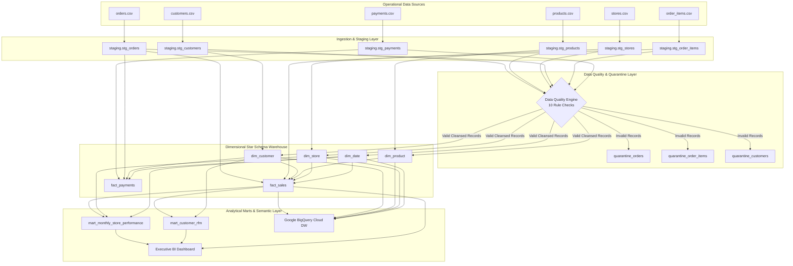

# RetailSphere Data Platform - End-to-End Data Lineage

## 1. High-Level Pipeline Lineage Architecture

## 2. Table-to-Table Dependency Matrix

| Target Table | Source Entity | Transformation Type | Business Logic & Surrogate Key Generation |
| :--- | :--- | :--- | :--- |
| `dim_customer` | `staging.stg_customers` | Cleansing, Deduplication, SCD Type 1/2 | Deduped on `customer_id` keeping newest registration; surrogate key `customer_key` generated via window ranking |
| `dim_product` | `staging.stg_products` | Enrichment, Pricing Tiering | Added `profit_margin_pct` and classified into `Budget`, `Mid-Range`, `Premium`, `Luxury` tiers |
| `dim_store` | `staging.stg_stores` | Channel Grouping, Age Calculation | Segmented into `Physical Retail` vs `Digital Channel`; computed `store_age_years` |
| `dim_date` | Date Generator Algorithm | Conformed Calendar Dimension | Generates full calendar, fiscal periods (Indian FY April-March), weekend and holiday flags |
| `fact_sales` | `stg_orders`, `stg_order_items`, Dimensions | Fact Grain Joins & Financial Metrics | Grain: 1 row per order item. Evaluates `net_sales_amount`, `cost_amount`, `gross_profit_amount`, `profit_margin_pct` |
| `fact_payments` | `stg_payments`, `stg_orders`, `dim_customer` | Financial Reconciliation | Maps payment transactions, validates against order values, evaluates success rates |
| `mart_monthly_store_performance` | `fact_sales`, `dim_date`, `dim_store` | Periodic Monthly Snapshot Aggregation | Computes MoM revenue, order counts, gross profit, margin percentage per store and territory |
| `mart_customer_rfm` | `fact_sales`, `dim_customer` | Behavioral Customer Segmentation | Calculates Recency (days), Frequency (order count), Monetary (total spend), and assigns RFM tiers |
